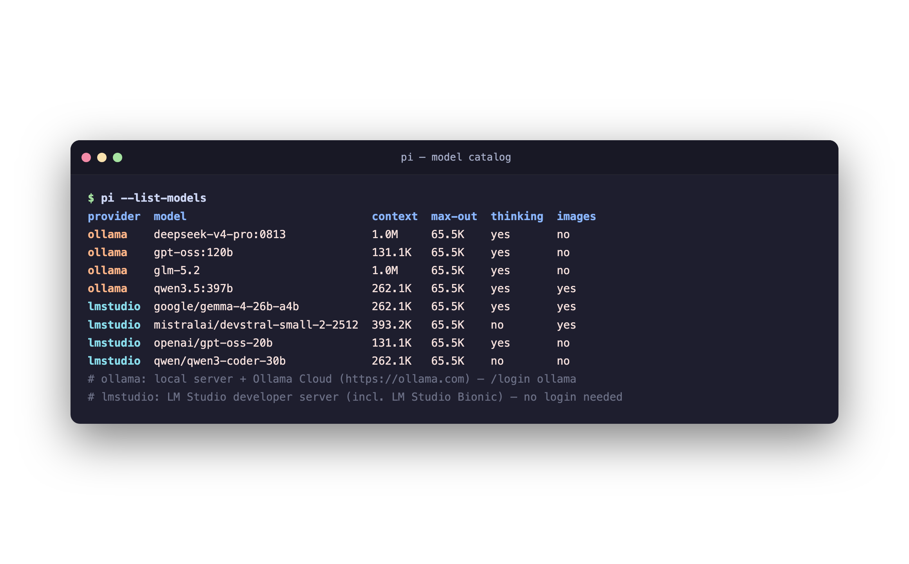

# pi-lm-providers - Ollama & LM Studio for pi

## Installation

```bash
pi install npm:pi-lm-providers
```

Alternatively, add `"npm:pi-lm-providers"` manually to `packages` in
`~/.pi/agent/settings.json`. Without npm: copy the `.ts` files into
`~/.pi/agent/extensions/lm-providers/` (pi loads them automatically).

For local development a path package is enough (changes take effect
directly after `/reload`, no reinstall):

```bash
pi install /path/to/pi-lm-providers
```

Registers two dynamic providers:

| Provider | Endpoint | Login |
|----------|----------|-------|
| `ollama` | Local server (`http://localhost:11434`) **or** Ollama Cloud (`https://ollama.com`) | `/login ollama` |
| `lmstudio` | LM Studio developer server (`http://localhost:1234`, incl. LM Studio Bionic) | `/login lmstudio` (optional) |

Models are discovered live from the server - including real capabilities
(tools/vision/thinking) and context windows where the server provides them.
Models without tool support are hidden (pi is an agent and needs tool
calling). Embedding models (LM Studio) are filtered out.



## Ollama

### Ollama Cloud (API key)

1. Create an API key: <https://ollama.com/settings/keys>
2. In pi: `/login ollama` -> **Ollama Cloud (ollama.com)** -> paste the key
3. `/model` -> e.g. `ollama/gpt-oss:120b`, `ollama/deepseek-v4-pro:0813`, `ollama/qwen3.5:397b`

### Local Ollama server

No login needed - the provider counts as configured as soon as the server
is reachable:

```bash
ollama serve                 # start the server
ollama pull gpt-oss:20b      # download a model
pi --provider ollama --model gpt-oss:20b
```

### Environment variables (optional)

| Variable | Meaning |
|----------|---------|
| `OLLAMA_MODE` | Force `cloud` or `local` |
| `OLLAMA_API_KEY` | Cloud API key; implies cloud mode when `OLLAMA_MODE` is unset |
| `OLLAMA_BASE_URL` | Override the full base URL (local & cloud, e.g. your own proxy) |
| `OLLAMA_HOST` | Local host in Ollama notation (`127.0.0.1`, `host:11434`, `https://gpu.corp:8443`) |
| `OLLAMA_CLOUD_BASE` | Override the cloud endpoint |

A stored `/login` decision (local vs. cloud) takes precedence over
environment detection.

## LM Studio

Start the server in LM Studio (Developer tab -> Start Server, or
`lms server start`). Default: `http://localhost:1234`, no authentication -
no login needed.

```bash
pi --provider lmstudio --model google/gemma-4-26b-a4b
```

If the server requires an API token (Developer tab -> API tokens):
`/login lmstudio` -> **API token** -> paste the token.

| Variable | Meaning |
|----------|---------|
| `LMSTUDIO_BASE_URL` | Full base URL (e.g. `http://mac-mini.local:1234`) |
| `LMSTUDIO_HOST` / `LMSTUDIO_PORT` | Host and port separately |
| `LMSTUDIO_API_KEY` or `LM_API_TOKEN` | API token |

Uses LM Studio's native `/api/v1/models` API (capabilities, loaded context
length, quantization); older servers fall back to `/v1/models`
automatically.

## Notes

- **Compat**: the providers send `system` (not `developer`), `max_tokens`
  (not `max_completion_tokens`) and no `reasoning_effort` parameters -
  thinking models reason at the server default, and the reasoning trace is
  shown in pi.
- **Context overflow**: server errors like "prompt is too long" are
  normalized so pi can compact the conversation automatically and retry.
- **Refreshing the model list**: models are loaded at pi startup; after
  `ollama pull ...` / downloading a model in LM Studio, a restart or
  `/reload` is enough.
- **Diagnostics**: if a refresh fails (pi only shows "Could not refresh
  ollama"), the underlying cause is written to
  `~/.pi/agent/lm-providers.log`.
- **Cloud costs**: usage tracking shows $0 - Ollama Cloud pricing is
  model-dependent (see <https://ollama.com/cloud>).
- **Important for local Ollama models**: Ollama allocates the runtime
  context server-side (model-dependent, configurable globally via
  `OLLAMA_CONTEXT_LENGTH`). On very long sessions the server can still
  throw "prompt is too long" - raise `OLLAMA_CONTEXT_LENGTH` and restart
  the server.
